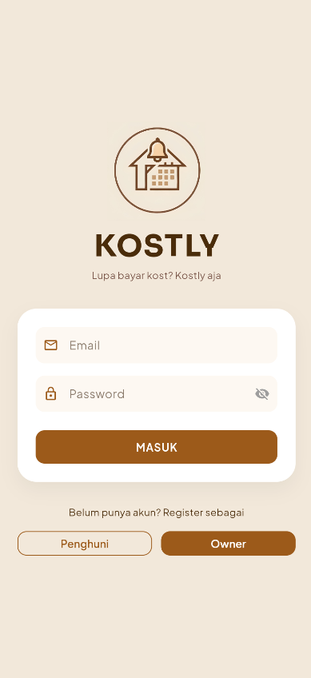
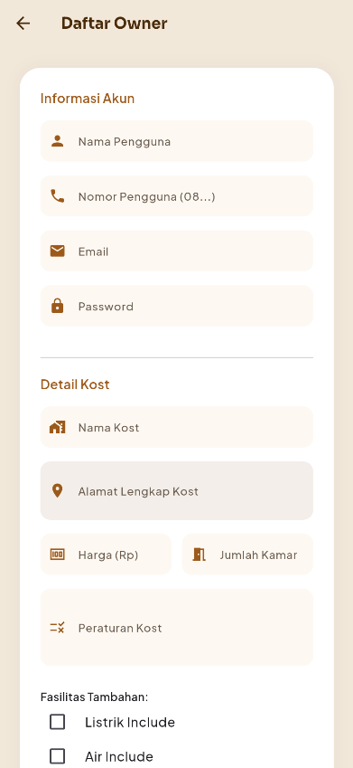
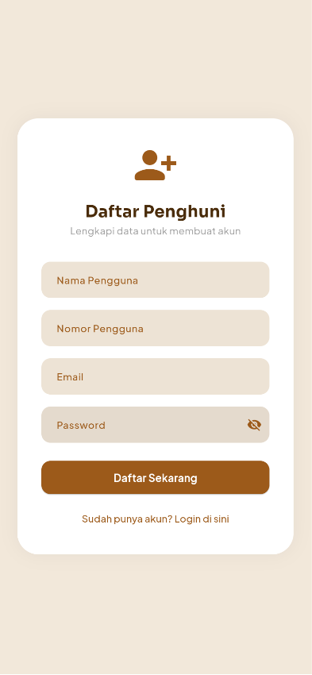
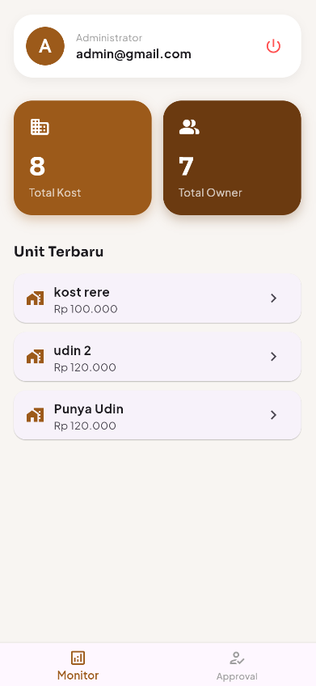
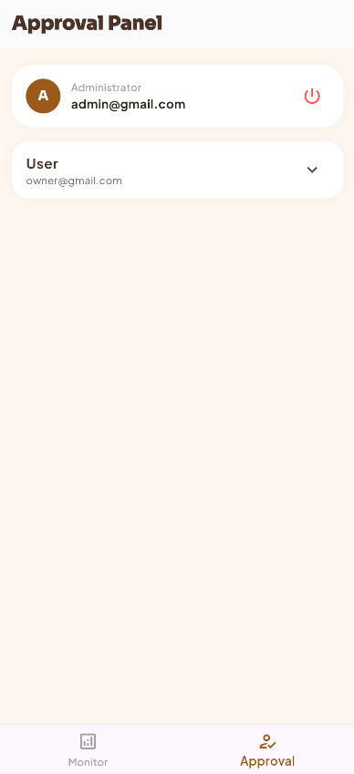
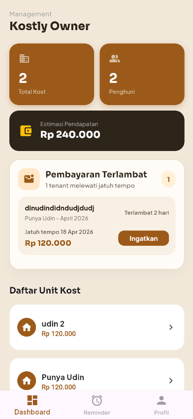
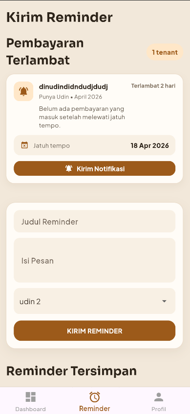
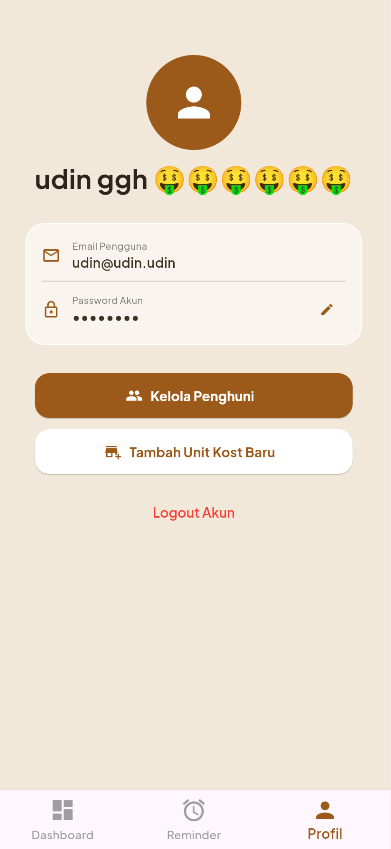
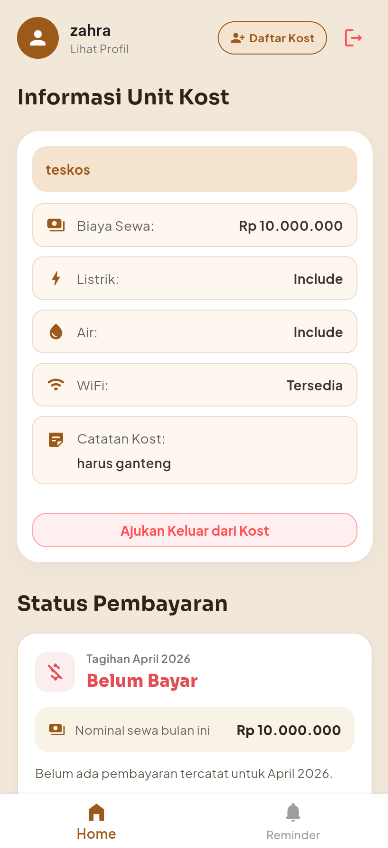

# KOSTLY ⾕

   
  <b>Aplikasi Manajemen Pengingat Kost Berbasis Digital</b>

# 👩‍💻 Kontributor 

| Rini Wulandari | Nur Ihsan | Alvionej|
|---------------|------------|-------------|
||  |  |
| 2409116048 | 2409116051 | 2409116073 |
| Sistem Informasi B '24 | Sistem Informasi B '24 |  Sistem Informasi B '24 |

# 🧾 Deskripsi Program

Aplikasi Manajemen Pengingat Kost Berbasis Digital adalah sistem yang dirancang untuk mempermudah pengelolaan kost secara lebih terstruktur dan efisien. Aplikasi ini membantu mengatasi permasalahan seperti keterlambatan pembayaran dan penyampaian informasi yang tidak merata melalui fitur pengingat otomatis dan sistem informasi terpusat.

Tujuan aplikasi ini adalah meningkatkan kedisiplinan pembayaran penghuni serta memudahkan pemilik kost dalam memantau dan mengelola data secara real-time. Selain itu, aplikasi ini juga bertujuan untuk memastikan informasi dapat tersampaikan dengan cepat, merata, dan lebih efektif kepada seluruh penghuni.

# 💻 Teknologi Yang Digunakan
Aplikasi ini dikembangkan untuk memudahkan pengguna dalam mengelola data secara tertata dan efisien. Pemilihan teknologi difokuskan agar program mudah dikembangkan dan aman, diantaranya yaitu :

1. **Bahasa Pemrograman:** Dart = Bahasa utama di balik framework Flutter yang cepat dan efisien.
2. **Framework UI:** Flutter = Memungkinkan tampilan aplikasi yang cantik dan responsif di berbagai perangkat.
3. **Backend & Database:** Supabase (PostgreSQL) = Digunakan untuk manajemen database relasional, autentikasi, dan penyimpanan data secara *real-time*.
4. **Arsitektur Program:** Layered Architecture (Role-Based) = Proyek ini menggunakan struktur berlapis yang memisahkan tanggung jawab kode berdasarkan peran pengguna dan fungsionalitas:

    - Data Layer (Services): Seluruh logika integrasi dengan database dan autentikasi dipusatkan pada folder services (contoh: supabase_service.dart).

    - View & Logic Layer (Pages): Antarmuka pengguna dipisahkan secara modular berdasarkan hak akses di dalam folder pages, yaitu admin_page untuk pengelola sistem dan owner_page untuk pemilik kost.

    - State-Driven Logic: Mengingat efisiensi pengembangan, logika operasional setiap fitur dikelola langsung di dalam state masing-masing halaman (seperti pada reminder_page.dart) untuk memastikan sinkronisasi data yang cepat tanpa memerlukan file controller terpisah.
5. **Version Control:** Git & GitHub — Digunakan untuk kolaborasi tim dan pelacakan perubahan kode.

# 📱 Fitur - Fitur Utama Program

### 🔹 Fitur untuk User (Penghuni Kost)
1. **Login via Join Code:** Mengakses sistem pengelolaan kost secara instan menggunakan kode unik yang diberikan oleh Owner.
2. **Detail Kost:** Melihat fasilitas, alamat, dan peraturan kost secara lengkap.
3. **Status Pembayaran:** Memantau status tagihan bulan ini (Lunas/Belum Bayar).
4. **Notifikasi Pengingat Otomatis:** Sistem peringatan dini yang memberitahu penghuni saat mendekati tanggal jatuh tempo pembayaran.
5. **Pusat Informasi & Broadcast:** Menerima pengumuman atau instruksi khusus secara langsung dari Owner terkait operasional kost.

### 🔹 Fitur untuk Owner (Pemilik Kost)
1. **Manajemen Properti Kost:** Kendali penuh untuk menambah, memperbarui, atau menghapus data kost serta mengelola kapasitas kamar.
2. **Verifikasi Penghuni:** Melakukan validasi dan persetujuan (approve) terhadap calon penghuni yang mendaftar menggunakan kode akses.
3. **Dashboard Pembayaran:** Memantau daftar penghuni yang sudah membayar atau yang masih menunggak.
4. **Generate Kode Join:** Membuat kode unik untuk diberikan kepada calon penghuni baru.

### 🔹 Fitur untuk Admin (Pengelola Sistem)
5. **Verifikasi Owner & Kost:** Memastikan pemilik kost yang mendaftar adalah pengguna valid.
6. **Monitoring Global:** Mengelola basis data pengguna dan memastikan keamanan sistem secara keseluruhan.
7. **Monitoring Global:** Mengawasi seluruh basis data pengguna dan lalu lintas sistem untuk menjaga stabilitas serta keamanan aplikasi secara menyeluruh.

### 🔹 Widget Yang Digunakan
Aplikasi ini dibangun menggunakan berbagai widget Flutter untuk fungsionalitas maksimal:

1. **TextFormField:** Untuk input data akun, nominal harga, dan alamat kost.
2. **DropdownButton:** Digunakan untuk memilih daftar kost yang dikelola oleh owner.
3. **CheckboxListTile:** Mempermudah pemilihan fasilitas kost (Listrik, Air, WiFi).
4. **ListView & ListTile:** Menampilkan daftar penghuni dan riwayat transaksi secara rapi.
5. **SnackBar:** Memberikan umpan balik instan jika registrasi atau pembayaran berhasil/gagal.
6. **Google Fonts:** Menggunakan font *Plus Jakarta Sans* untuk tampilan yang modern dan profesional.
7. **CircularProgressIndicator:** Memberikan umpan balik visual berupa indikator pemuatan (loading) yang berputar saat aplikasi sedang melakukan sinkronisasi data dengan Supabase atau selama proses pengiriman reminder.
8. **SingleChildScrollView:** Widget yang memungkinkan seluruh tampilan halaman dapat digulir (scrollable), sangat penting untuk mencegah error layout overflow saat pengguna membuka keyboard atau saat konten halaman melebihi ukuran layar perangkat.
9. **LinearProgressIndicator:** Indikator pemuatan berbentuk garis mendatar, memberikan umpan balik visual yang halus saat proses transisi atau pengiriman data berlangsung.
10. **RefreshIndicator:** Mengimplementasikan fitur "Pull-to-Refresh", memudahkan pengguna untuk memperbarui daftar data (seperti riwayat reminder atau status pembayaran) hanya dengan menarik layar ke bawah.

### 🔹Package Tambahan
Untuk mendukung estetika dan fungsionalitas pengolahan data, aplikasi ini juga mengintegrasikan beberapa package pendukung:

1. **Google Fonts (google_fonts):** Digunakan untuk kustomisasi tipografi secara dinamis. Dalam proyek ini, kami menggunakan font Plus Jakarta Sans untuk memberikan kesan tampilan yang modern, bersih, dan profesional tanpa perlu mengunduh file font secara manual ke dalam aset proyek.

2. **Intl (intl):** Package ini berperan penting dalam internasionalisasi dan lokalisasi data. Kami menggunakannya untuk:

- Formatting Mata Uang: Mengubah angka mentah dari database menjadi format Rupiah (IDR) agar informasi biaya kost mudah dipahami.

- Formatting Tanggal: Mengelola tampilan tanggal jatuh tempo dan riwayat pembayaran agar sesuai dengan format waktu lokal yang user-friendly.

### Fitur awal

### Fitur registrasi
1. **Registrasi Owner:** 

2. **Registrasi Penghuni:** 

### Fitur Admin
1. **Halaman Monitor Admin:**

2. **Halaman Approval Admin:**

### FItur Owner
1. **Dashboard Owner:**

2. **Halaman Reminder Owner:**

3. **Halaman Profile Owner**

### Fitur User
1. **Halaman Home User:**

2. **Halaman Reminder User:**